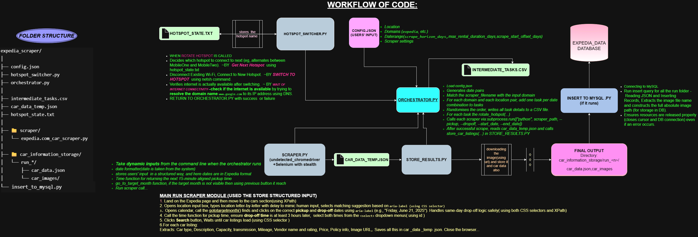

# Expedia Car Rental Scraper

This project is an automated scraping pipeline for fetching car rental listings from Expedia across various domains. It includes hotspot rotation (IP switching), data persistence, and MySQL storage support.

---

## 🚀 Features

- Scrapes car listings with full metadata from Expedia (multi-domain capable)
- Supports location/date configurations via `config.json`
- Hotspot-based IP rotation (supports 2 WiFi hotspots)
- Automatically saves images and listing data
- Inserts structured data into a MySQL database

---

## 🧠 Project Workflow

Below is a visual representation of the workflow for the Expedia Car Scraper and IP Rotation system:



## 🧩 Folder Structure

expedia_car_scraper/
├── scraper/ # Contains domain-specific scraper script
├── car_information_storage/ # Stores scraped JSONs + images
├── hotspot_switcher.py # Rotates between "MobileOne" & "MobileTwo"
├── orchestrator.py # Main pipeline runner
├── store_results.py # Moves scraped results into storage folders
├── insert_to_mysql.py # Inserts final data into MySQL
├── config.json # Configures locations, domains, date range


---

## 🔧 Setup

### 1. Python Packages

```bash
pip install undetected-chromedriver selenium mysql-connector-python

### 2. MySQL Setup
CREATE DATABASE expedia_data;

USE expedia_data;

CREATE TABLE car_listings (
    id INT AUTO_INCREMENT PRIMARY KEY,
    car_type VARCHAR(255),
    price VARCHAR(255),
    vendor VARCHAR(255),
    description TEXT,
    capacity VARCHAR(50),
    transmission VARCHAR(50),
    mileage VARCHAR(100),
    policies TEXT,
    vendor_rating VARCHAR(50),
    image_file VARCHAR(255),
    scrape_time DATETIME,
    car_rank INT,
    domain VARCHAR(100),
    image_path TEXT
);

⚙️ Usage
1. Configure Tasks
Edit the config.json to set pickup/drop-off locations, domains, and scraping dates.

2. Run the Pipeline
python orchestrator.py

3. Insert Scraped Data into MySQL
python insert_to_mysql.py

🖥️ Notes
Make sure both WiFi hotspots are preconfigured in Windows (netsh wlan show profiles)

Scraped results will appear in car_information_storage/ after each task

intermediate_tasks.csv is a debug output for verifying generated task matrix

---
